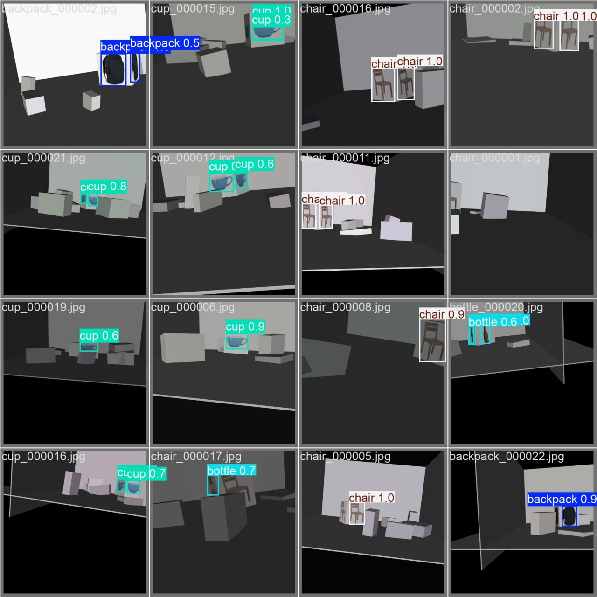
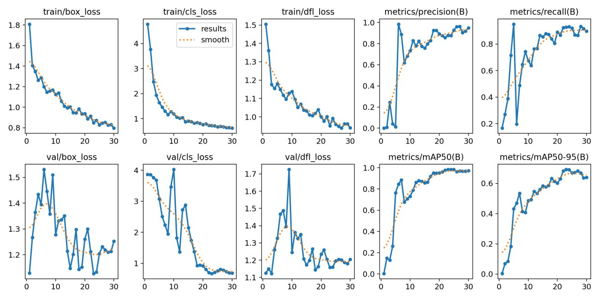

# Roboschool Competition Controller

Autonomous controller implementation for an Aliengo robotics competition environment. The project combines RGB-D perception, YOLO-based object detection, object memory, path planning, and velocity control for a quadruped robot in simulation.

The base simulator, bridge, and competition environment were provided by the competition organizers. This repository focuses on the implemented controller logic: detection integration, navigation, and ROS2/Python controller variants.

## Project Scope

The competition task required the robot to work in a simulated environment, process camera and depth data, detect target objects, navigate toward relevant targets, and publish robot velocity commands.

This repository includes:

- a Python controller for the base competition runtime;
- a ROS2-oriented controller for bridge-based execution;
- an object detection module using a trained Ultralytics YOLO model artifact;
- navigation logic based on RGB-D perception, occupancy mapping, A* planning, Pure Pursuit control, and close-obstacle recovery.

## Contribution

The implemented project work in this repository is centered on:

- controller logic in `src/aliengo_competition/controllers/main_controller.py`;
- ROS2 controller adaptation in `ros2_isaac_bridge/sim_side/controller.py`;
- integration of YOLO inference into the perception pipeline;
- conversion of image detections and depth values into local object coordinates;
- occupancy grid updates from depth observations;
- object memory and mission target selection;
- A* path planning over the occupancy grid;
- Pure Pursuit command generation;
- close-obstacle recovery behavior.

The object detector was trained on a manually prepared synthetic dataset for the competition objects. The trained model is used by the controller as `models/best.pt`.

## System Overview

```text
RGB-D camera data
        |
        v
Input handling and pose estimation
        |
        v
YOLO detection + depth-based localization
        |
        v
Object memory and mission logic
        |
        v
Occupancy grid + A* path planning
        |
        v
Pure Pursuit controller + obstacle recovery
        |
        v
Velocity commands for Aliengo
```

## Architecture

The solution is organized as a layered robotics pipeline. Each layer converts raw simulator data into a more task-oriented representation until the final layer produces robot motion commands.

### 1. Input Layer

`InputHandler` collects the current camera frame, depth map, robot velocity, timestamp, and camera intrinsics. It also maintains a simple local pose estimate by integrating the robot velocity over time.

This layer prepares a unified frame object:

```text
rgb image
depth image
local pose estimate
timestamp
camera intrinsics
```

### 2. Perception Layer

`ScenePerception` receives the prepared frame and runs object detection through `detect_markers(...)`. The detector uses the RGB image for recognition and the depth frame for estimating the local 3D position of detected objects.

For each detection, the pipeline:

1. takes the bounding-box center;
2. reads the corresponding depth value;
3. projects the pixel into local camera coordinates;
4. returns object class, local position, and confidence.

### 3. Mapping Layer

`OccupancyGridMap` builds a local grid representation from depth observations. The map separates free, occupied, and unknown cells and gives the planner a compact navigation space.

The map is updated from sampled depth rays, which makes it possible to plan around nearby obstacles instead of relying only on direct target movement.

### 4. Object Memory and Mission Logic

`ObjectMemory` stores detected objects across frames, updates their positions, and tracks whether a target has already been visited. `MissionLogic` uses this memory together with the target queue to select the next object to approach.

This prevents the robot from treating every frame independently and gives the controller a persistent task state.

### 5. Path Planning Layer

`AStarPlanner` searches for a path through the occupancy grid. `NavigationPlanner` manages replanning and converts grid paths back into world coordinates.

If a planned path is available, the robot follows it. If the map does not yet provide enough structure for a full path, the controller can still fall back to direct movement toward the target.

### 6. Motion Control Layer

`PurePursuitController` converts a path into velocity commands using a lookahead point. `CloseObstacleRecovery` monitors the front depth area and can override the nominal command when an obstacle is too close.

The final controller output is a velocity command:

```text
vx, vy, wz
```

For the ROS2 variant, this command is published to `/cmd_vel`.

## Detection Examples

Example detections on synthetic validation images:



The detector was trained to recognize competition-relevant objects in synthetic scenes. The example above shows predicted bounding boxes and confidence scores for several object classes.

## Training Metrics

Training and validation curves for the detector:



The curves show decreasing training losses and strong validation metrics across the training run, including precision, recall, mAP50, and mAP50-95. These plots are included as project evidence; exact benchmark claims should still be tied to the original training logs if they are published later.

## Main Components

### Perception

The perception pipeline reads RGB and depth frames, runs YOLO inference, filters detections by confidence, and estimates local object coordinates using camera intrinsics and depth values.

Relevant code:

- `detect_markers(...)`
- `ScenePerception`
- `InputHandler`

### Detection Model

The controllers load the model artifact from:

```text
models/best.pt
```

The code uses the `ultralytics` package to load the YOLO model. The repository includes the trained model artifact used by the controller and visual evidence of the training/evaluation run.

The model was trained on a manually prepared synthetic dataset. The README does not claim production readiness or a public benchmark result; the included plots and examples document the project-specific detector behavior.

### Navigation

The navigation stack builds an internal map and selects movement commands toward active targets.

Relevant modules:

- `OccupancyGridMap`
- `ObjectMemory`
- `MissionLogic`
- `AStarPlanner`
- `PurePursuitController`
- `NavigationPlanner`
- `CloseObstacleRecovery`

### ROS2 Controller

The ROS2 controller subscribes to robot state and camera topics, runs the same high-level perception/navigation logic, and publishes velocity commands.

Main file:

```text
ros2_isaac_bridge/sim_side/controller.py
```

Key topic groups:

- `/cmd_vel`
- `/aliengo/base_velocity`
- `/aliengo/camera/color/image_raw`
- `/aliengo/camera/depth/image_raw`
- `/aliengo/joint_states`
- `/aliengo/imu`
- `competition/object_sequence`
- `competition/detected_object`

## Repository Structure

```text
.
|-- assets/
|   |-- detection_examples.png
|   `-- training_metrics.png
|-- models/
|   `-- best.pt
|-- src/
|   `-- aliengo_competition/
|       `-- controllers/
|           `-- main_controller.py
|-- ros2_isaac_bridge/
|   |-- README.md
|   |-- run_bridge_node.sh
|   `-- sim_side/
|       |-- controller.py
|       |-- isaac_controller.py
|       `-- sim_bridge_client.py
|-- task-description.md
|-- setup.py
`-- README.md
```

## Technologies

- Python
- NumPy
- ROS2 / `rclpy`
- Ultralytics YOLO
- RGB-D camera processing
- Occupancy grid mapping
- A* path planning
- Pure Pursuit control
- Isaac Gym / Aliengo competition environment

## Running Notes

The original competition environment supports both Python-controller and ROS2 bridge-based workflows. See the existing environment files and `ros2_isaac_bridge/README.md` for infrastructure details.

The controller code expects the model artifact at:

```text
models/best.pt
```

Required Python-side dependencies include at least:

```text
numpy
ultralytics
```

The ROS2 controller additionally requires a ROS2 environment with the message packages used by the organizer-provided bridge.

## Limitations

- The simulator and base competition environment were provided by the organizers.
- No final competition score or benchmark metric is claimed here.
- The included detector results describe this project setup and synthetic validation data, not a production robotics benchmark.
- The project is kept as a competition implementation artifact, not as a production robotics system.

## Original Task Context

The original competition task description is preserved in:

```text
task-description.md
```

That file describes the organizer-provided problem setting. This README focuses on the implemented controller and navigation/detection logic.
